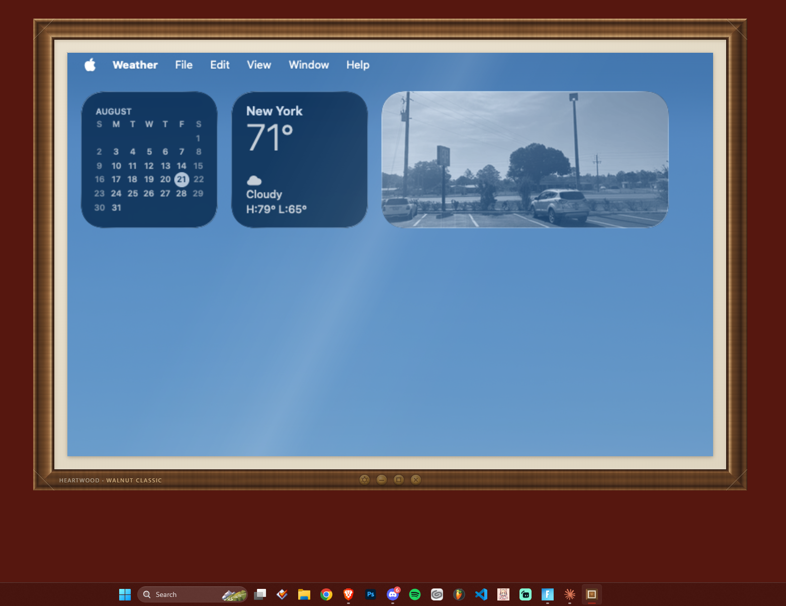
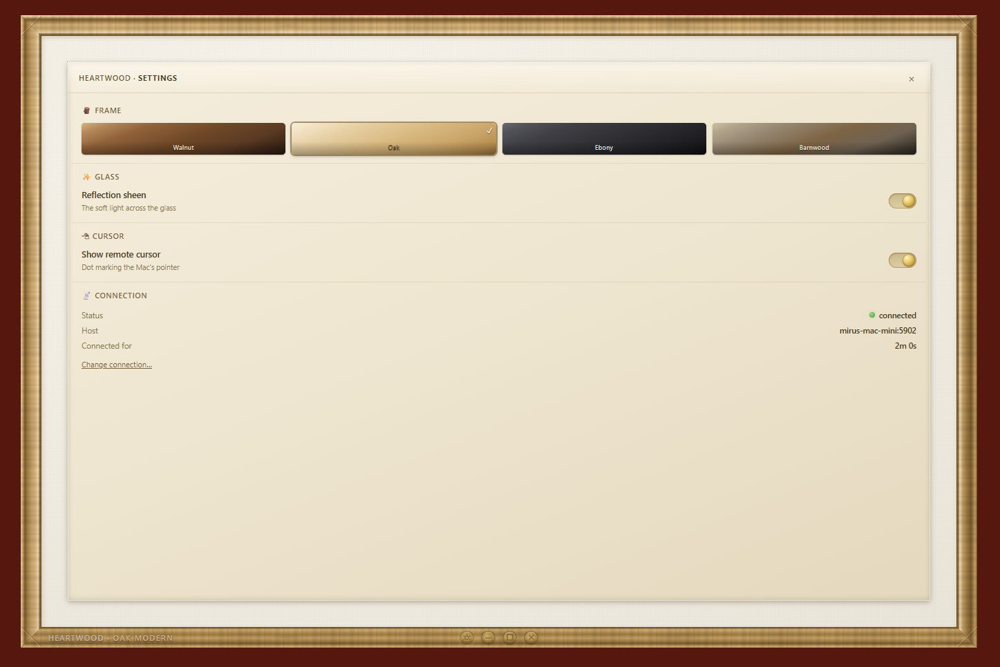
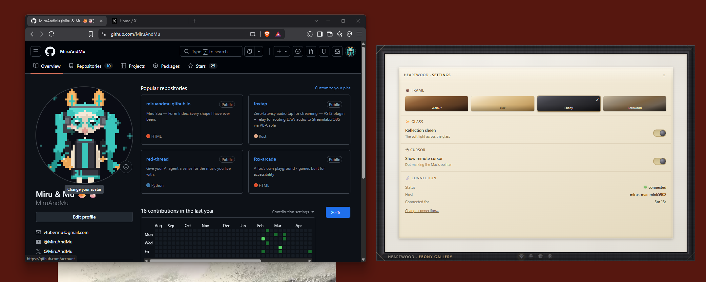
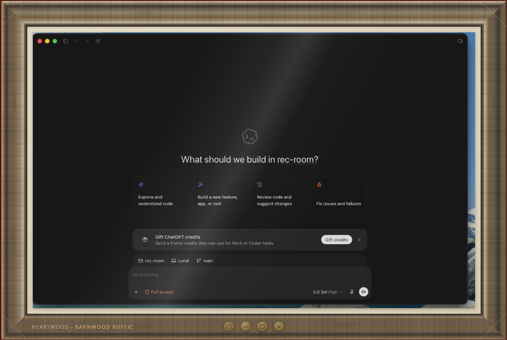

# Heartwood VNC 🪵

**Your Mac, framed on your PC.**

Heartwood VNC is a remote-desktop viewer with a soul. It connects your Windows
PC to your Mac in two ways:

- **Full view** — your Mac's screen fills your PC monitor edge-to-edge, like
  the Mac simply replaced it.
- **Framed** — drag a box around *any part* of your Mac's screen, and it hangs
  on your PC desktop as a living picture in a handcrafted wooden frame.
  Walnut, oak, ebony, or barnwood. Brass fixtures. A nameplate. It's a real
  window — click it, type into it — dressed as furniture.

## The frames, in the wild

| | |
|---|---|
|  *Walnut Classic — the whole Mac, hung on Windows* |  *Oak Modern — frame, glass & connection settings* |
|  *Ebony Gallery — living beside your PC windows* |  *Barnwood Rustic — one Mac window as furniture* |

Every other viewer gives you the whole remote desktop in a gray utility
window. Heartwood lets you keep just the piece you care about — your Mac's
music player, one chat window, a dashboard — as a persistent, native-feeling
window on your PC. A window that's open on your PC but *really* open on
your Mac.

---

## Requirements

- A **Windows PC** (the viewer) and a **Mac** (the viewed).
- Both on the **same network** — home LAN or the same
  [Tailscale](https://tailscale.com) tailnet.
- That's it. No accounts, no cloud, no subscription. Your screen never
  leaves your network.

## Setup — about 5 minutes, once

### On the Mac (2 steps)

1. **Turn on Screen Sharing:**
   System Settings → General → Sharing → **Screen Sharing → ON**.
   Click the **(i)** beside it and enable
   **"VNC viewers may control screen with password"** — choose a password.
   (This password is the only key to your screen. Make it a good one.)

2. **Run the setup command** — open Terminal, paste:

   ```sh
   bash heartwood-mac-setup.sh
   ```

   It checks your setup, installs a small relay in `~/.heartwood`
   (auto-starts on boot), and ends by telling you your Mac's address.
   It never sees, asks for, or stores your password.

   *Later:* `--status` shows what's running; `--uninstall` removes
   everything cleanly.

### On the PC (1 step)

3. **Run `HeartwoodVNC.exe`.** A card appears: enter the Mac's address
   (from step 2) and the password (from step 1). **Hang the frame.**

That's the whole thing. From then on it opens straight into your Mac.

## Using it

- **🖼 Frame It** (top-right, or while unframed) — drag a box around the part
  of the Mac screen you want; the frame assembles around it. Drag the wood to
  move it; drag the corners to resize; brass buttons to minimize or close.
- **⚙ Settings** (fourth brass fixture, framed mode) — choose your wood
  (walnut / oak / ebony / barnwood), toggle the glass sheen, toggle the
  remote-cursor dot, and view connection status.
- **Changed your Mac password?** The app notices it can't connect and hands
  you the card to enter the new one. (Change it anytime in System Settings —
  nothing else to update.)
- **Panic key:** `Ctrl+Alt+L` forces the window visible and interactive from
  anywhere. `Ctrl+Alt+Q` quits.

## Security, honestly

- **Your password is never stored on the Mac side.** The relay is a
  pass-through: your Mac itself judges every login attempt.
- On the PC it's stored encrypted at rest via Windows' own DPAPI
  (`safeStorage`) — only your Windows user on your machine can decrypt it.
- The connection between PC and Mac is **not additionally encrypted** —
  which is fine on a home LAN, and encrypted end-to-end anyway if you use
  Tailscale (WireGuard). **Do not** port-forward or expose ports
  5900–5902 to the internet. The safe path is the easy path: same LAN,
  or Tailscale.
- **One active viewer, with a real tradeoff:** a new connection attempt
  closes the current bridge connection *before* the Mac judges the
  newcomer's password. That prevents two simultaneous viewers — but it
  means any device that can reach the bridge can interrupt your session
  just by knocking (it still can't get in without your password; your
  viewer reconnects on retry). It's an availability tradeoff, not an
  access-control guarantee — one more reason the bridge belongs on a
  trusted network only.
- A diagnostic log (connection events, no passwords, no screen content)
  is written locally to help with troubleshooting. Delete it anytime.

## Troubleshooting — the three usual suspects

| Symptom | Likely cause | Fix |
|---|---|---|
| Card says it can't reach the Mac | Screen Sharing off, Mac asleep, or wrong address | `heartwood-mac-setup.sh --status` on the Mac; check the address ends in `.local` |
| "The Mac refused that password" | Password typo, or you rotated it | Type the current Screen Sharing password into the card |
| Connected but black screen | Mac is at its login screen | Click into the view and log in — your Mac, your password |

## Credits

Built on [noVNC](https://novnc.com) (MPL-2.0) and
[websockify](https://github.com/novnc/websockify) (LGPL-3.0), with
[Electron](https://electronjs.org). The wood is CSS. The frame is love.

VNC® is a registered trademark of RealVNC Ltd. Heartwood VNC is an
independent project and is not affiliated with or endorsed by RealVNC.

---

*Heartwood — the oldest wood at the center of the tree, the part that holds
everything up.*
